```mermaid
flowchart TB
    subgraph current["UAMIDemo.Web.csproj"]
        MAIN["<b>📦&nbsp;UAMIDemo.Web.csproj</b><br/><small>net8.0</small>"]
        click MAIN "#uamidemowebcsproj"
    end

```

# Projects and dependencies analysis

This document provides a comprehensive overview of the projects and their dependencies in the context of upgrading to .NETCoreApp,Version=v10.0.

## Table of Contents

- [Executive Summary](#executive-Summary)
  - [Highlevel Metrics](#highlevel-metrics)
  - [Projects Compatibility](#projects-compatibility)
  - [Package Compatibility](#package-compatibility)
  - [API Compatibility](#api-compatibility)
- [Aggregate NuGet packages details](#aggregate-nuget-packages-details)
- [Top API Migration Challenges](#top-api-migration-challenges)
  - [Technologies and Features](#technologies-and-features)
  - [Most Frequent API Issues](#most-frequent-api-issues)
- [Projects Relationship Graph](#projects-relationship-graph)
- [Project Details](#project-details)

  - [UAMIDemo.Web.csproj](#uamidemowebcsproj)

## Executive Summary

### Highlevel Metrics

| Metric | Count | Status |
| :--- | :---: | :--- |
| Total Projects | 1 | All require upgrade |
| Total NuGet Packages | 6 | 2 need upgrade |
| Total Code Files | 10 |  |
| Total Code Files with Incidents | 4 |  |
| Total Lines of Code | 779 |  |
| Total Number of Issues | 8 |  |
| Estimated LOC to modify | 5+ | at least 0.6% of codebase |

### Projects Compatibility

| Project | Target Framework | Difficulty | Package Issues | API Issues | Est. LOC Impact | Description |
| :--- | :---: | :---: | :---: | :---: | :---: | :--- |
| [UAMIDemo.Web.csproj](#uamidemowebcsproj) | net8.0 | 🟢 Low | 2 | 5 | 5+ | AspNetCore, Sdk Style = True |

### Package Compatibility

| Status | Count | Percentage |
| :--- | :---: | :---: |
| ✅ Compatible | 4 | 66.7% |
| ⚠️ Incompatible | 1 | 16.7% |
| 🔄 Upgrade Recommended | 1 | 16.7% |
| ***Total NuGet Packages*** | ***6*** | ***100%*** |

### API Compatibility

| Category | Count | Impact |
| :--- | :---: | :--- |
| 🔴 Binary Incompatible | 1 | High - Require code changes |
| 🟡 Source Incompatible | 0 | Medium - Needs re-compilation and potential conflicting API error fixing |
| 🔵 Behavioral change | 4 | Low - Behavioral changes that may require testing at runtime |
| ✅ Compatible | 902 |  |
| ***Total APIs Analyzed*** | ***907*** |  |

## Aggregate NuGet packages details

| Package | Current Version | Suggested Version | Projects | Description |
| :--- | :---: | :---: | :--- | :--- |
| Azure.Identity | 1.14.0 |  | [UAMIDemo.Web.csproj](#uamidemowebcsproj) | ⚠️NuGet package is deprecated |
| Azure.ResourceManager | 1.13.2 |  | [UAMIDemo.Web.csproj](#uamidemowebcsproj) | ✅Compatible |
| Azure.ResourceManager.KeyVault | 1.3.3 |  | [UAMIDemo.Web.csproj](#uamidemowebcsproj) | ✅Compatible |
| Azure.ResourceManager.ManagedServiceIdentities | 1.2.0 |  | [UAMIDemo.Web.csproj](#uamidemowebcsproj) | ✅Compatible |
| Azure.Security.KeyVault.Secrets | 4.6.0 |  | [UAMIDemo.Web.csproj](#uamidemowebcsproj) | ✅Compatible |
| Microsoft.AspNetCore.Mvc.Razor.RuntimeCompilation | 8.0.2 | 10.0.3 | [UAMIDemo.Web.csproj](#uamidemowebcsproj) | NuGet package upgrade is recommended |

## Top API Migration Challenges

### Technologies and Features

| Technology | Issues | Percentage | Migration Path |
| :--- | :---: | :---: | :--- |

### Most Frequent API Issues

| API | Count | Percentage | Category |
| :--- | :---: | :---: | :--- |
| T:System.Uri | 2 | 40.0% | Behavioral Change |
| M:System.Uri.#ctor(System.String) | 1 | 20.0% | Behavioral Change |
| M:Microsoft.AspNetCore.Builder.ExceptionHandlerExtensions.UseExceptionHandler(Microsoft.AspNetCore.Builder.IApplicationBuilder,System.String) | 1 | 20.0% | Behavioral Change |
| M:Microsoft.Extensions.DependencyInjection.OptionsConfigurationServiceCollectionExtensions.Configure''1(Microsoft.Extensions.DependencyInjection.IServiceCollection,Microsoft.Extensions.Configuration.IConfiguration) | 1 | 20.0% | Binary Incompatible |

## Projects Relationship Graph

Legend:
📦 SDK-style project
⚙️ Classic project

```mermaid
flowchart LR
    P1["<b>📦&nbsp;UAMIDemo.Web.csproj</b><br/><small>net8.0</small>"]
    click P1 "#uamidemowebcsproj"

```

## Project Details

### UAMIDemo.Web.csproj

#### Project Info

- **Current Target Framework:** net8.0
- **Proposed Target Framework:** net10.0
- **SDK-style**: True
- **Project Kind:** AspNetCore
- **Dependencies**: 0
- **Dependants**: 0
- **Number of Files**: 14
- **Number of Files with Incidents**: 4
- **Lines of Code**: 779
- **Estimated LOC to modify**: 5+ (at least 0.6% of the project)

#### Dependency Graph

Legend:
📦 SDK-style project
⚙️ Classic project

### API Compatibility

| Category | Count | Impact |
| :--- | :---: | :--- |
| 🔴 Binary Incompatible | 1 | High - Require code changes |
| 🟡 Source Incompatible | 0 | Medium - Needs re-compilation and potential conflicting API error fixing |
| 🔵 Behavioral change | 4 | Low - Behavioral changes that may require testing at runtime |
| ✅ Compatible | 902 |  |
| ***Total APIs Analyzed*** | ***907*** |  |

