# .NET 10 Upgrade Plan for UAMIDemo.Web

## Table of Contents

- [Executive Summary](#executive-summary)
- [Migration Strategy](#migration-strategy)
- [Detailed Dependency Analysis](#detailed-dependency-analysis)
- [Project-by-Project Plans](#project-by-project-plans)
  - [UAMIDemo.Web.csproj](#uamidemowebcsproj)
- [Package Update Reference](#package-update-reference)
- [Breaking Changes Catalog](#breaking-changes-catalog)
- [Risk Management](#risk-management)
- [Testing & Validation Strategy](#testing--validation-strategy)
- [Complexity & Effort Assessment](#complexity--effort-assessment)
- [Source Control Strategy](#source-control-strategy)
- [Success Criteria](#success-criteria)

---

## Executive Summary

### Scenario Description

This plan guides the upgrade of **UAMIDemo.Web** from **.NET 8.0** to **.NET 10.0 (Long Term Support)**. The application is an ASP.NET Core web application demonstrating User-Assigned Managed Identity (UAMI) integration with Azure Key Vault.

### Scope

**Projects Affected**: 1 project
- UAMIDemo.Web.csproj (ASP.NET Core application)

**Current State**:
- Target Framework: net8.0
- Total Lines of Code: 779
- NuGet Packages: 6
- Code Files: 10 (4 with incidents)

**Target State**:
- Target Framework: net10.0
- Updated packages: 2 packages require updates
- Estimated Code Changes: 5+ lines (~0.6% of codebase)

### Selected Strategy

**All-At-Once Strategy** - Single project upgraded in one atomic operation.

**Rationale**:
- Single project with no project dependencies
- Small codebase (779 LOC)
- Low complexity rating
- All packages have clear upgrade paths or are compatible
- No security vulnerabilities requiring immediate attention
- Straightforward migration with minimal risk

### Complexity Assessment

**Discovered Metrics**:
- **Project Count**: 1
- **Dependency Depth**: 0 (standalone project)
- **Package Issues**: 2 (1 deprecated, 1 upgrade recommended)
- **API Issues**: 5 (1 binary incompatible, 4 behavioral changes)
- **Risk Level**: 🟢 Low

**Complexity Classification**: **Simple**

### Critical Issues

1. **Azure.Identity 1.14.0** - Package is deprecated (requires replacement)
2. **Microsoft.AspNetCore.Mvc.Razor.RuntimeCompilation** - Requires upgrade from 8.0.2 to 10.0.3
3. **Binary Incompatible API** - `Configure<T>` method signature change in dependency injection
4. **Behavioral Changes** - 4 APIs with behavioral changes (System.Uri, UseExceptionHandler)

### Recommended Approach

**All-At-Once Strategy** is optimal for this single-project solution:
- Update project file target framework to net10.0
- Update all package references in single operation
- Address breaking changes during compilation
- Comprehensive testing after upgrade completes

### Iteration Strategy

Using **fast batch approach**:
- Phase 1: Foundation (3 iterations) ✓
- Phase 2: Detailed planning (2 iterations for single project)
- Total expected iterations: 5

---

## Migration Strategy

### Approach Selection

**Selected Strategy**: **All-At-Once Strategy**

**Justification**:
- ✅ Single project solution - no coordination complexity
- ✅ Small codebase (779 LOC) - manageable in single operation
- ✅ Low complexity rating - minimal breaking changes expected
- ✅ No project dependencies - no cascading impacts
- ✅ All packages have clear upgrade paths or are compatible
- ✅ No security vulnerabilities requiring phased approach
- ✅ SDK-style project - modern, clean project structure

### All-At-Once Strategy Rationale

The All-At-Once approach is optimal for this scenario because:

1. **Atomic Operation Benefits**:
   - All changes applied simultaneously
   - Single build/test cycle
   - No intermediate multi-targeting states
   - Reduced overall timeline

2. **Risk Profile**:
   - Low complexity minimizes risk
   - Single point of validation
   - Clear success criteria (builds with 0 errors)
   - Straightforward rollback if needed

3. **Efficiency**:
   - Fastest completion time
   - No multi-targeting overhead
   - Clean dependency resolution
   - Simple coordination

### Dependency-Based Ordering

Since there are no project dependencies, ordering constraints do not apply. The single project will be upgraded in one atomic operation.

### Execution Approach

**Sequential Execution**: All operations performed in order:

1. **Update Project File** - Change TargetFramework to net10.0
2. **Update Package References** - Update all packages atomically
3. **Restore Dependencies** - Run dotnet restore
4. **Build Solution** - Identify compilation errors
5. **Fix Breaking Changes** - Address all compilation errors
6. **Rebuild and Verify** - Confirm 0 errors
7. **Run Tests** - Validate functionality

### Phase Definitions

**Phase 0: Preparation**
- Verify .NET 10 SDK installed
- Verify current branch (upgrade-to-NET10)
- Backup current state (git commit)

**Phase 1: Atomic Upgrade**
- Update UAMIDemo.Web.csproj target framework
- Update all package references
- Restore dependencies
- Build and fix compilation errors
- **Success Criteria**: Solution builds with 0 errors

**Phase 2: Testing & Validation**
- Run application smoke tests
- Validate Azure Key Vault integration
- Validate managed identity functionality
- **Success Criteria**: All tests pass, application runs successfully

---

## Detailed Dependency Analysis

### Dependency Graph Summary

UAMIDemo.Web is a **standalone project** with no project-to-project dependencies.

```mermaid
flowchart LR
    P1["📦 UAMIDemo.Web.csproj<br/>(net8.0 → net10.0)"]

    style P1 fill:#4CAF50,stroke:#2E7D32,stroke-width:2px,color:#fff
```



### Project Groupings by Migration Phase

**Single Phase Migration**: All changes occur atomically in one phase.

**Phase 1: Atomic Upgrade**
- UAMIDemo.Web.csproj
  - Current: net8.0
  - Target: net10.0
  - Type: ASP.NET Core Web Application
  - Dependencies: 0 project dependencies
  - Dependants: 0 (leaf node)

### Critical Path Identification

Since this is a single-project solution, the critical path is straightforward:

1. **Update Target Framework** → net10.0
2. **Update NuGet Packages** → 2 packages requiring updates
3. **Address Breaking Changes** → 5 API issues to resolve
4. **Build and Verify** → Ensure 0 errors
5. **Test** → Validate application functionality

**No circular dependencies detected.**
**No blocking dependencies - can proceed immediately.**

### Migration Order Rationale

With a single project, the All-At-Once strategy is optimal:
- No dependency constraints to manage
- All changes can be applied atomically
- Single build/test cycle
- Minimal coordination required
- Fastest path to completion

---

## Project-by-Project Plans

### UAMIDemo.Web.csproj

**Current State**:
- Target Framework: net8.0
- Project Type: ASP.NET Core Web Application
- SDK-style: True
- Lines of Code: 779
- Package Count: 6
- Dependencies: 0 project dependencies
- Dependants: 0
- Files with Incidents: 4

**Target State**:
- Target Framework: net10.0
- Updated Packages: 2 (1 deprecated, 1 version upgrade)

#### Prerequisites

1. ✅ .NET 10 SDK installed and verified
2. ✅ On upgrade branch (upgrade-to-NET10)
3. ✅ No blocking project dependencies
4. ✅ Clean build on net8.0 before upgrade

#### Migration Steps

**Step 1: Update Target Framework**

Update the project file `UAMIDemo.Web.csproj`:

```xml
<TargetFramework>net10.0</TargetFramework>
```

**File Location**: `UAMIDemo.Web.csproj`
**Change**: `net8.0` → `net10.0`

**Step 2: Update Package References**

Update package references in `UAMIDemo.Web.csproj`:

| Package | Current Version | Target Version | Action |
|---------|----------------|----------------|--------|
| Microsoft.AspNetCore.Mvc.Razor.RuntimeCompilation | 8.0.2 | 10.0.3 | Update version |
| Azure.Identity | 1.14.0 | (research required) | Address deprecation |

See [Package Update Reference](#package-update-reference) for complete details.

**Step 3: Research Azure.Identity Deprecation**

Before updating packages, research Azure.Identity 1.14.0 deprecation:
1. Check Azure.Identity release notes for deprecation details
2. Identify if 1.14.0 still functions with .NET 10
3. Determine if newer version (e.g., 1.15.0+) resolves deprecation
4. Review breaking changes in newer Azure.Identity versions
5. Check impact on existing code (KeyVaultService, AzureResourceService)

**Expected Outcome**: Identify target version or replacement package.

**Step 4: Address Expected Breaking Changes**

See [Breaking Changes Catalog](#breaking-changes-catalog) for comprehensive list.

**Focus Areas**:

1. **Binary Incompatible API** (Program.cs):
   - API: `Configure<T>(IServiceCollection, IConfiguration)`
   - Location: Program.cs (likely in dependency injection setup)
   - Action: Update method signature per .NET 10 API
   - Expected: May need to adjust how `AzureSettings` is configured

2. **Behavioral Changes**:
   - **System.Uri** (2 instances): Review URI construction/parsing code
   - **Uri Constructor**: Check any direct URI instantiation
   - **UseExceptionHandler**: Review exception handling middleware setup
   - Location: Program.cs, Controllers, Services

**Step 5: Restore Dependencies**

```bash
dotnet restore
```

**Expected Outcome**: All packages restored successfully.

**Step 6: Build and Identify Compilation Errors**

```bash
dotnet build
```

**Expected Issues**:
- Binary incompatible API errors (Configure<T>)
- Potential Azure.Identity API changes
- Obsolete API warnings

**Step 7: Fix Compilation Errors**

Address each compilation error systematically:

1. **Configure<T> API Error**:
   - Review error message for correct signature
   - Update call site in Program.cs
   - Validate service configuration still works

2. **Azure.Identity Changes** (if applicable):
   - Update authentication code in KeyVaultService
   - Update credential initialization
   - Verify managed identity configuration

3. **Other Breaking Changes**:
   - Address any additional compilation errors
   - Update obsolete API usage
   - Fix namespace changes

**Step 8: Rebuild and Verify**

```bash
dotnet build
```

**Success Criteria**: ✅ Solution builds with 0 errors, 0 warnings

#### Testing Strategy

**Unit Testing**:
- Currently no automated unit tests detected in assessment
- Manual validation required

**Integration Testing**:
1. **Application Startup**:
   - Run `dotnet run`
   - Verify application starts without errors
   - Check https://localhost:58067 and http://localhost:58068 accessibility

2. **Configuration Management**:
   - Test ConfigController endpoints
   - Verify runtime configuration works
   - Validate AzureSettings binding

3. **Azure Key Vault Integration**:
   - Test SecretsController endpoints
   - Verify KeyVaultService connectivity (if Azure resources available)
   - Validate managed identity authentication

4. **Azure Resource Management**:
   - Test AzureResourceService operations (if Azure resources available)
   - Verify managed identity integration works

**Behavioral Change Testing**:
1. Test any URI construction/parsing code
2. Verify exception handling behaves as expected
3. Check logging and error pages

**Performance Testing**:
- Compare startup time (should be similar or faster)
- Monitor memory usage
- Check request handling performance

#### Validation Checklist

- [ ] Project builds without errors
- [ ] Project builds without warnings
- [ ] Application starts successfully
- [ ] Configuration endpoints respond correctly
- [ ] Secrets endpoints respond correctly (if Azure accessible)
- [ ] Azure Key Vault integration works (if Azure accessible)
- [ ] Managed identity authentication succeeds (if Azure accessible)
- [ ] No behavioral regressions in URI handling
- [ ] Exception handling works as expected
- [ ] No Azure.Identity deprecation warnings
- [ ] All package dependencies resolved correctly

---

## Package Update Reference

### Package Update Matrix

| Package | Current | Target | Projects | Update Reason | Priority |
|---------|---------|--------|----------|---------------|----------|
| Microsoft.AspNetCore.Mvc.Razor.RuntimeCompilation | 8.0.2 | 10.0.3 | UAMIDemo.Web.csproj | Framework compatibility - recommended upgrade | High |
| Azure.Identity | 1.14.0 | (TBD) | UAMIDemo.Web.csproj | Package is deprecated - research required | High |

### Compatible Packages (No Update Required)

| Package | Current Version | Status |
|---------|----------------|--------|
| Azure.ResourceManager | 1.13.2 | ✅ Compatible with .NET 10 |
| Azure.ResourceManager.KeyVault | 1.3.3 | ✅ Compatible with .NET 10 |
| Azure.ResourceManager.ManagedServiceIdentities | 1.2.0 | ✅ Compatible with .NET 10 |
| Azure.Security.KeyVault.Secrets | 4.6.0 | ✅ Compatible with .NET 10 |

### Package-Specific Upgrade Notes

#### Microsoft.AspNetCore.Mvc.Razor.RuntimeCompilation

**Current**: 8.0.2  
**Target**: 10.0.3

**Reason**: Aligns with .NET 10 framework version. ASP.NET Core packages should match target framework major version.

**Breaking Changes**: None expected. This is a runtime compilation package used for development (hot reload). Version alignment ensures compatibility with .NET 10 runtime.

**Migration Steps**:
1. Update PackageReference version to 10.0.3
2. No code changes expected
3. Verify runtime compilation works in development mode

**Affected Files**: UAMIDemo.Web.csproj

#### Azure.Identity

**Current**: 1.14.0  
**Target**: Research required

**Reason**: Package is marked as deprecated in assessment.

**Investigation Required**:
1. Check Azure.Identity NuGet page for deprecation notice details
2. Determine if 1.14.0 is officially deprecated or just flagged by analysis tool
3. Identify latest stable version (likely 1.15.0 or higher)
4. Review release notes for breaking changes between 1.14.0 and target version
5. Check if package is being replaced by different package entirely

**Potential Impact**:
- **Low Impact**: If newer version (1.15.x) is drop-in replacement with no API changes
- **Medium Impact**: If newer version has minor API changes requiring code updates
- **High Impact**: If package is replaced entirely, requiring refactoring of authentication code

**Affected Code**:
- Services/KeyVaultService.cs - Uses Azure.Identity for Key Vault authentication
- Services/AzureResourceService.cs - Uses Azure.Identity for Azure resource authentication
- Services/RuntimeConfigService.cs - May manage identity credentials
- Program.cs - Dependency injection setup for identity credentials

**Migration Strategy**:
1. Research deprecation details first (before making changes)
2. If simple version upgrade: Update PackageReference and test
3. If API changes: Update affected code in services
4. If package replacement: Evaluate impact and plan refactoring
5. Test thoroughly with Azure resources (Key Vault, managed identity)

### Package Update Execution Order

For All-At-Once strategy, all packages updated simultaneously:

1. Update Microsoft.AspNetCore.Mvc.Razor.RuntimeCompilation to 10.0.3
2. Update Azure.Identity to determined target version
3. Run `dotnet restore`
4. Address any package dependency conflicts
5. Proceed to build phase

---

## Breaking Changes Catalog

### Overview

The assessment identified 5 API compatibility issues requiring attention during the upgrade from .NET 8 to .NET 10.

### Binary Incompatible APIs (High Priority)

These APIs **will cause compilation errors** and must be fixed.

#### 1. Configure<T> Method - Dependency Injection

**API**: `Microsoft.Extensions.DependencyInjection.OptionsConfigurationServiceCollectionExtensions.Configure<T>(IServiceCollection, IConfiguration)`

**Issue Type**: 🔴 Binary Incompatible

**Impact**: Compilation error - method signature changed

**Affected Code**: Program.cs (likely in service configuration)

**Current Usage (Expected)**:
```csharp
services.Configure<AzureSettings>(configuration);
```

**Required Change**: 
- Review .NET 10 documentation for updated Configure<T> signature
- Update method call to use new signature
- May require additional parameters or different method overload

**Files Likely Affected**:
- Program.cs (dependency injection setup)

**Fix Priority**: ✅ Critical - Will block compilation

**Validation**: Application starts successfully and AzureSettings are properly configured

---

### Behavioral Changes (Medium Priority)

These APIs **compile successfully** but have changed runtime behavior. Testing required.

#### 2. System.Uri Type

**API**: `System.Uri` (Type)

**Issue Type**: 🔵 Behavioral Change

**Count**: 2 instances

**Impact**: Runtime behavior may differ in URI handling

**Potential Changes**:
- URI parsing rules may have changed
- Normalization behavior differences
- Encoding/decoding changes
- Validation rules modified

**Affected Code Areas**:
- Any URI construction code
- Key Vault URI handling in KeyVaultService
- Azure resource URI handling in AzureResourceService

**Recommended Actions**:
1. Review .NET 10 System.Uri behavioral changes documentation
2. Identify all System.Uri usage in codebase
3. Test URI parsing, especially for Azure resource URIs
4. Verify Key Vault URI construction works correctly
5. Check any configuration URIs in appsettings

**Fix Priority**: 🟡 Medium - Test thoroughly

**Validation**: 
- Key Vault URIs resolve correctly
- Azure resource URIs are constructed properly
- No URI-related runtime errors

#### 3. Uri Constructor

**API**: `System.Uri.Uri(string)`

**Issue Type**: 🔵 Behavioral Change

**Count**: 1 instance

**Impact**: URI constructor may validate or parse differently

**Affected Code**: Any code that constructs URIs from strings

**Recommended Actions**:
1. Review .NET 10 Uri constructor changes
2. Test with Key Vault URIs (e.g., "https://{keyvault}.vault.azure.net/")
3. Verify exception handling for invalid URIs

**Fix Priority**: 🟡 Medium - Test thoroughly

**Validation**: URI construction works as expected in all scenarios

#### 4. UseExceptionHandler Extension Method

**API**: `Microsoft.AspNetCore.Builder.ExceptionHandlerExtensions.UseExceptionHandler(IApplicationBuilder, string)`

**Issue Type**: 🔵 Behavioral Change

**Count**: 1 instance

**Impact**: Exception handling middleware behavior may differ

**Affected Code**: Program.cs (middleware pipeline configuration)

**Current Usage (Expected)**:
```csharp
app.UseExceptionHandler("/Error");
```

**Potential Changes**:
- Exception handling flow differences
- Error page routing changes
- Exception details exposure changes
- Status code handling modifications

**Recommended Actions**:
1. Review .NET 10 exception handling changes
2. Test exception scenarios (500 errors, unhandled exceptions)
3. Verify error page routing works correctly
4. Check exception logging still functions

**Fix Priority**: 🟡 Medium - Test thoroughly

**Validation**: 
- Exception handling works correctly
- Error pages display as expected
- No sensitive information exposed
- Logging captures exceptions

---

### Breaking Changes Summary

| Priority | Count | Action Required |
|----------|-------|-----------------|
| 🔴 Critical (Binary Incompatible) | 1 | Must fix before build succeeds |
| 🔵 Medium (Behavioral Changes) | 4 | Must test thoroughly after upgrade |
| **Total** | **5** | |

### Code Review Areas

When addressing breaking changes, pay special attention to:

1. **Program.cs**: 
   - Dependency injection configuration (Configure<T>)
   - Exception handling middleware (UseExceptionHandler)

2. **Services/KeyVaultService.cs**:
   - Key Vault URI construction (System.Uri)
   - Authentication credential handling (Azure.Identity)

3. **Services/AzureResourceService.cs**:
   - Azure resource URI handling (System.Uri)
   - Resource manager authentication

4. **Configuration Files**:
   - Any URIs in appsettings.json
   - Key Vault URI configuration

### Testing Strategy for Breaking Changes

1. **Compilation Phase**:
   - Fix Configure<T> binary incompatibility
   - Resolve any Azure.Identity API changes

2. **Runtime Testing Phase**:
   - Test URI construction for Key Vault
   - Test URI construction for Azure resources
   - Trigger exceptions to test exception handling
   - Verify error pages work correctly

3. **Integration Testing Phase**:
   - Full end-to-end testing with Azure services
   - Validate managed identity authentication
   - Test all controller endpoints

---

## Risk Management

### High-Risk Changes

| Risk Level | Project | Description | Mitigation Strategy |
|------------|---------|-------------|---------------------|
| 🟡 Medium | UAMIDemo.Web.csproj | Azure.Identity 1.14.0 is deprecated - may require code changes if replacement package has different API | Research Azure.Identity deprecation details before upgrade; identify replacement package; review migration guide |
| 🟡 Medium | UAMIDemo.Web.csproj | Binary incompatible API: `Configure<T>` method in dependency injection | Identify all usages in Program.cs; apply updated method signature; validate service configuration |
| 🟢 Low | UAMIDemo.Web.csproj | 4 behavioral changes in System.Uri and exception handling | Review behavioral change documentation; add runtime testing for affected code paths |
| 🟢 Low | UAMIDemo.Web.csproj | Package upgrade: Microsoft.AspNetCore.Mvc.Razor.RuntimeCompilation 8.0.2 → 10.0.3 | Straightforward version upgrade; no known breaking changes |

### Risk Assessment by Category

**Package Risks**:
- **Deprecated Package**: Azure.Identity 1.14.0
  - Impact: May require code changes if deprecated APIs are used
  - Likelihood: Medium (deprecation indicates future removal)
  - Mitigation: Research replacement package and migration path before upgrade

**API Compatibility Risks**:
- **Binary Incompatible**: 1 API (dependency injection configuration)
  - Impact: Compilation errors requiring code changes
  - Likelihood: High (will fail to compile)
  - Mitigation: Apply updated method signature from .NET 10 documentation

- **Behavioral Changes**: 4 APIs
  - Impact: Runtime behavior may differ
  - Likelihood: Low (application likely not affected)
  - Mitigation: Comprehensive runtime testing

**Overall Risk Level**: 🟢 **Low to Medium**

### Security Vulnerabilities

✅ **No security vulnerabilities detected** in current package versions.

### Contingency Plans

**If Azure.Identity deprecation blocks upgrade**:
1. Research Microsoft's recommended replacement package
2. If replacement requires significant refactoring, create separate branch for identity migration
3. Consider maintaining Azure.Identity 1.14.0 temporarily if still functional
4. Escalate to team for timeline adjustment if needed

**If binary incompatible API cannot be easily resolved**:
1. Consult .NET 10 migration documentation for Configure<T> method
2. Search for similar migration examples in Microsoft documentation
3. Consider alternative dependency injection configuration patterns
4. Create minimal reproduction case for community/Microsoft support if needed

**If behavioral changes cause runtime issues**:
1. Identify specific affected code paths through testing
2. Review .NET 10 behavioral change documentation for each API
3. Implement workarounds or adapt code to new behavior
4. Add regression tests for affected functionality

**Rollback Strategy**:
- All changes on dedicated branch (upgrade-to-NET10)
- Can revert to master branch if upgrade blocked
- Git commit after each major step for granular rollback
- No changes to production until full validation complete

---

## Testing & Validation Strategy

### Multi-Level Testing Approach

Testing is organized into three levels: per-project validation, phase validation, and full solution validation.

### Phase 0: Pre-Upgrade Validation

**Before starting upgrade**, verify baseline functionality:

- [ ] Application builds successfully on .NET 8
- [ ] Application runs successfully on .NET 8
- [ ] All existing functionality works
- [ ] Document baseline behavior for comparison

**Purpose**: Establish known-good state for rollback if needed.

### Phase 1: Atomic Upgrade Testing

**After completing atomic upgrade** (project file + packages + breaking changes):

#### Build Validation
- [ ] Solution builds with 0 errors
- [ ] Solution builds with 0 warnings
- [ ] All package dependencies resolved
- [ ] No framework compatibility errors

#### Quick Smoke Test
- [ ] Application starts without runtime errors
- [ ] Web server listens on expected ports (58067 HTTPS, 58068 HTTP)
- [ ] Home page loads successfully
- [ ] No startup exceptions in logs

**Success Criteria**: Application compiles and starts successfully.

### Phase 2: Comprehensive Validation Testing

#### Functional Testing

**1. Configuration Management**
- [ ] GET /api/config endpoints respond correctly
- [ ] Configuration values load from appsettings.json
- [ ] RuntimeConfigService manages credentials in memory
- [ ] AzureSettings binding works correctly

**2. Azure Key Vault Integration** (if Azure resources available)
- [ ] KeyVaultService initializes successfully
- [ ] GET /api/secrets endpoints respond correctly
- [ ] Managed identity authentication succeeds
- [ ] Secrets retrieved from Key Vault
- [ ] Key Vault URI construction works correctly

**3. Azure Resource Management** (if Azure resources available)
- [ ] AzureResourceService initializes successfully
- [ ] Managed identity authentication to Azure Resource Manager succeeds
- [ ] Azure resource operations work correctly
- [ ] Resource URIs constructed properly

**4. Exception Handling**
- [ ] Trigger 404 error - error page displays correctly
- [ ] Trigger 500 error - exception handler catches and displays correctly
- [ ] Unhandled exceptions logged appropriately
- [ ] No sensitive information exposed in errors

#### Behavioral Change Testing

**System.Uri Behavioral Changes**:
- [ ] Test Key Vault URI construction: "https://{keyvault}.vault.azure.net/"
- [ ] Test Azure resource URIs with special characters
- [ ] Verify URI parsing handles edge cases (trailing slashes, query strings)
- [ ] No URI-related exceptions in normal operation

**UseExceptionHandler Behavioral Changes**:
- [ ] Exception handling middleware works correctly
- [ ] Error page routing functions as expected
- [ ] Exception details captured in logs
- [ ] Status codes returned correctly (500 for unhandled exceptions)

#### Integration Testing

**End-to-End Scenarios**:
1. **Managed Identity Flow**:
   - Start application
   - Configure credentials via RuntimeConfigService (or use managed identity)
   - Retrieve secret from Key Vault
   - Perform Azure resource operation
   - Verify entire flow works

2. **Configuration Update Flow**:
   - Update configuration via API
   - Verify configuration persisted in memory
   - Verify configuration changes take effect

#### Performance Testing

- [ ] Application startup time (compare to .NET 8 baseline)
- [ ] Memory usage (compare to .NET 8 baseline)
- [ ] Response times for API endpoints (compare to .NET 8 baseline)
- [ ] No performance regressions

**Expectation**: .NET 10 should have similar or better performance than .NET 8.

#### Regression Testing

- [ ] All functionality that worked in .NET 8 still works in .NET 10
- [ ] No new exceptions or errors
- [ ] Behavior matches expected outcomes
- [ ] Compare against documented baseline from Phase 0

### Testing Checklist by Feature

| Feature | Test Scenario | Expected Outcome | Status |
|---------|---------------|------------------|--------|
| Application Startup | Run `dotnet run` | App starts, no errors | ⬜ |
| HTTPS Endpoint | Navigate to https://localhost:58067 | Page loads | ⬜ |
| HTTP Endpoint | Navigate to http://localhost:58068 | Page loads | ⬜ |
| Config API | GET /api/config | Returns configuration | ⬜ |
| Secrets API | GET /api/secrets | Returns secrets (if Azure available) | ⬜ |
| Managed Identity | Authenticate to Key Vault | Authentication succeeds | ⬜ |
| Exception Handling | Trigger error | Error page displays | ⬜ |
| URI Handling | Key Vault URI construction | URIs valid | ⬜ |
| Package Dependencies | Verify all packages loaded | No conflicts | ⬜ |

### Manual Testing Procedures

Since no automated unit tests were detected, manual testing is required:

**Procedure 1: Basic Application Health**
```bash
cd UAMIDemo.Web
dotnet build
dotnet run
# Verify no errors in console output
# Open browser to https://localhost:58067
# Verify page loads
# Check for JavaScript errors in browser console
```

**Procedure 2: Configuration Testing**
```bash
# Use curl, Postman, or browser to test:
GET https://localhost:58067/api/config
# Verify JSON response with configuration data
```

**Procedure 3: Azure Key Vault Testing** (if resources available)
```bash
# Configure Azure credentials in RuntimeConfigService or use managed identity
GET https://localhost:58067/api/secrets/{secretName}
# Verify secret value returned
```

**Procedure 4: Exception Testing**
```bash
# Navigate to non-existent route
GET https://localhost:58067/nonexistent
# Verify error page displays (not raw exception)
```

### Test Environment Requirements

- .NET 10 SDK installed
- Development machine with Visual Studio 2022 or VS Code
- Browsers for testing web endpoints
- (Optional) Azure Key Vault resource for full integration testing
- (Optional) Azure User-Assigned Managed Identity for authentication testing

### Success Criteria Summary

✅ **Phase 1 Success**: Application builds and starts without errors

✅ **Phase 2 Success**: 
- All functional tests pass
- All behavioral change tests pass
- No performance regressions
- No functionality regressions
- Full integration with Azure works (if tested)

---

## Complexity & Effort Assessment

### Per-Project Complexity

| Project | Complexity | LOC | Packages | API Issues | Risk Level | Notes |
|---------|------------|-----|----------|------------|------------|-------|
| UAMIDemo.Web.csproj | 🟢 Low | 779 | 6 | 5 | Low-Medium | Single ASP.NET Core app, straightforward upgrade |

### Phase Complexity Assessment

**Phase 0: Preparation**
- Complexity: 🟢 Low
- Activities: SDK verification, branch confirmation
- Estimated Relative Effort: Minimal

**Phase 1: Atomic Upgrade**
- Complexity: 🟢 Low
- Activities: Update project file, update packages, fix breaking changes, build
- Estimated Relative Effort: Low
- Key Factors:
  - Small codebase (779 LOC)
  - Only 5 API issues to address
  - 2 package updates
  - 1 binary incompatible API (straightforward fix)

**Phase 2: Testing & Validation**
- Complexity: 🟢 Low
- Activities: Application testing, Azure integration validation
- Estimated Relative Effort: Low
- Key Factors:
  - Well-defined functionality (Azure Key Vault, Managed Identity)
  - Clear test scenarios
  - Existing application structure remains unchanged

### Overall Assessment

**Total Complexity**: 🟢 **Low**

**Effort Drivers**:
1. Azure.Identity deprecation research (primary effort)
2. Binary incompatible API fix (Configure<T> method)
3. Behavioral change testing (System.Uri, exception handling)
4. Package version updates

**Relative Complexity Breakdown**:
- Project file updates: Low (mechanical change)
- Package updates: Low (2 packages, clear versions)
- Breaking change fixes: Low-Medium (1 binary incompatible, 4 behavioral)
- Testing: Low (small application, focused functionality)

### Resource Requirements

**Skills Required**:
- .NET 8 → .NET 10 migration experience (helpful)
- ASP.NET Core knowledge
- Azure SDK familiarity (for Azure.Identity deprecation)
- Dependency injection understanding (for Configure<T> API)

**Parallelization Capacity**:
- Not applicable (single project)
- All work sequential on single project

**Tooling**:
- .NET 10 SDK required
- Visual Studio 2022 or VS Code
- Git for source control
- Access to Azure resources for integration testing (if applicable)

---

## Source Control Strategy

### Branching Strategy

**Current Setup**:
- **Main Branch**: `master`
- **Upgrade Branch**: `upgrade-to-NET10` ✅ (current branch)
- **Branch Type**: Feature branch for upgrade work

**Branching Approach**:
- All upgrade work performed on dedicated `upgrade-to-NET10` branch
- Main branch (`master`) remains on .NET 8 until upgrade validated
- Enables safe experimentation and easy rollback
- Clean separation between stable and upgrade work

### Commit Strategy

**Recommended Commit Frequency**: Single commit for All-At-Once upgrade

Since this is an All-At-Once strategy with a single project, the most efficient approach is:

**Single Atomic Commit**:
```
git add UAMIDemo.Web.csproj [modified project file]
git add <any-code-files-changed> [breaking change fixes]
git commit -m "Upgrade UAMIDemo.Web to .NET 10

- Update target framework from net8.0 to net10.0
- Update Microsoft.AspNetCore.Mvc.Razor.RuntimeCompilation to 10.0.3
- Address Azure.Identity deprecation (update to version X.Y.Z)
- Fix Configure<T> binary incompatible API in Program.cs
- Address System.Uri behavioral changes
- Address UseExceptionHandler behavioral changes
- Verify all tests pass
- Confirm zero build errors/warnings"
```

**Alternative: Granular Commits** (if preferred):
1. Commit 1: Update project file target framework
2. Commit 2: Update package references
3. Commit 3: Fix breaking changes
4. Commit 4: Final validation and cleanup

**Message Format**:
- Use conventional commit format
- Include specific changes in commit body
- Reference any issues or tickets if applicable

### Checkpoints

**Checkpoint 1: Pre-Upgrade State**
```bash
git add -A
git commit -m "Pre-upgrade checkpoint: Clean .NET 8 baseline"
```
Purpose: Create restore point before any changes

**Checkpoint 2: Post-Upgrade State** (after upgrade complete and tested)
```bash
git add -A
git commit -m "Upgrade UAMIDemo.Web to .NET 10 - Complete and validated"
```
Purpose: Mark completion of upgrade work

### Review and Merge Process

**Pull Request Requirements**:

**Title**: `Upgrade UAMIDemo.Web to .NET 10`

**Description Template**:
```markdown
## Summary
Upgrades UAMIDemo.Web from .NET 8 to .NET 10 (LTS).

## Changes
- Updated target framework: net8.0 → net10.0
- Updated Microsoft.AspNetCore.Mvc.Razor.RuntimeCompilation: 8.0.2 → 10.0.3
- Addressed Azure.Identity deprecation: 1.14.0 → [version]
- Fixed binary incompatible API: Configure<T> in Program.cs
- Tested behavioral changes: System.Uri, UseExceptionHandler

## Testing
- ✅ Builds with 0 errors, 0 warnings
- ✅ Application starts successfully
- ✅ Configuration endpoints functional
- ✅ Secrets endpoints functional (if Azure available)
- ✅ Azure Key Vault integration works (if Azure available)
- ✅ Managed identity authentication works (if Azure available)
- ✅ Exception handling verified
- ✅ No performance regressions
- ✅ No functional regressions

## Breaking Changes
- Configure<T> method signature updated in Program.cs
- System.Uri behavioral changes tested and validated
- UseExceptionHandler behavioral changes tested and validated

## Risk Assessment
🟢 Low risk - single project, straightforward upgrade, thoroughly tested

## Rollback Plan
Revert merge commit if issues discovered in production
```

**Review Checklist**:
- [ ] All commits follow message format
- [ ] No temporary or debug code
- [ ] No real credentials committed (placeholders only)
- [ ] Build artifacts removed (bin/, obj/)
- [ ] Code changes aligned with breaking changes documentation
- [ ] All tests passed (or manual validation documented)
- [ ] Performance validated
- [ ] Azure integration validated (if applicable)

**Merge Criteria**:
- ✅ All PR checks pass
- ✅ Code review approved (if required by team)
- ✅ All validation checklist items completed
- ✅ No outstanding questions or concerns
- ✅ Deployment plan confirmed

### Post-Merge Strategy

**After Merging to Master**:
1. Tag the release:
   ```bash
   git tag -a v2.0.0-net10 -m "UAMIDemo.Web upgraded to .NET 10"
   git push origin v2.0.0-net10
   ```

2. Monitor production (if deployed):
   - Application health
   - Performance metrics
   - Error logs
   - Azure integration functionality

3. Keep upgrade branch for reference:
   ```bash
   # Don't delete immediately - keep for historical reference
   # Delete after confirmed stable in production (e.g., 30 days)
   ```

### Rollback Procedures

**If issues discovered before merge**:
```bash
git checkout master  # Return to stable branch
# upgrade-to-NET10 branch remains for future work
```

**If issues discovered after merge**:
```bash
git revert <merge-commit-hash>  # Revert the merge
# Or create hotfix branch from master and fix issue
```

**Emergency Rollback**:
```bash
git checkout master
git reset --hard <commit-before-merge>
git push --force origin master  # Use with extreme caution
```

### Branch Cleanup

**After successful production deployment and monitoring period**:
```bash
# Delete remote branch
git push origin --delete upgrade-to-NET10

# Delete local branch
git branch -d upgrade-to-NET10
```

**Recommendation**: Keep branch for at least 30 days after production deployment for reference.

### Collaboration Notes

**For Single Developer**:
- Commit frequency: Single atomic commit preferred
- Push regularly to backup work
- Tag important milestones

**For Team**:
- Commit more frequently for visibility
- Use feature flags if deploying before fully complete
- Coordinate deployment timing
- Communicate upgrade progress in team channels

---

## Success Criteria

### Technical Criteria

The upgrade is considered technically successful when:

#### Build Criteria
- ✅ **All projects build successfully**: UAMIDemo.Web.csproj compiles without errors
- ✅ **Zero compilation warnings**: No warnings related to framework upgrade
- ✅ **All package dependencies resolved**: No package conflicts or missing dependencies
- ✅ **Target framework updated**: Project targets net10.0

#### Package Criteria
- ✅ **All packages updated**: Microsoft.AspNetCore.Mvc.Razor.RuntimeCompilation updated to 10.0.3
- ✅ **Deprecated package addressed**: Azure.Identity deprecation resolved (updated or replaced)
- ✅ **Compatible packages verified**: All 4 compatible packages still function correctly
- ✅ **No security vulnerabilities**: No new vulnerabilities introduced

#### API Compatibility Criteria
- ✅ **Binary incompatible API fixed**: Configure<T> method updated and working
- ✅ **Behavioral changes tested**: All 4 behavioral changes tested and validated
  - System.Uri (2 instances) - tested and working
  - Uri constructor - tested and working
  - UseExceptionHandler - tested and working
- ✅ **No runtime API errors**: No unexpected API exceptions during testing

#### Application Functionality Criteria
- ✅ **Application starts successfully**: Runs on https://localhost:58067 and http://localhost:58068
- ✅ **Configuration management works**: ConfigController endpoints respond correctly
- ✅ **Secrets management works**: SecretsController endpoints respond correctly (if Azure available)
- ✅ **Azure Key Vault integration works**: KeyVaultService authenticates and retrieves secrets (if Azure available)
- ✅ **Azure Resource management works**: AzureResourceService performs operations correctly (if Azure available)
- ✅ **Managed identity works**: Authentication using UAMI succeeds (if Azure available)
- ✅ **Exception handling works**: Error pages display correctly, exceptions logged appropriately

### Quality Criteria

#### Code Quality
- ✅ **Code quality maintained**: No code quality regressions introduced
- ✅ **No security issues**: No real credentials committed, placeholders used
- ✅ **Clean codebase**: No temporary debug code, commented-out code removed
- ✅ **Build artifacts cleaned**: No bin/, obj/, .vs/ artifacts committed

#### Performance Criteria
- ✅ **Startup time acceptable**: Similar or faster than .NET 8 baseline
- ✅ **Memory usage acceptable**: Similar or lower than .NET 8 baseline
- ✅ **Response time acceptable**: API endpoints respond in reasonable time
- ✅ **No performance regressions**: Overall performance similar or better than .NET 8

#### Testing Criteria
- ✅ **All smoke tests pass**: Basic application health verified
- ✅ **All functional tests pass**: All features work as expected
- ✅ **All behavioral change tests pass**: URI handling, exception handling validated
- ✅ **Integration tests pass**: Azure Key Vault, managed identity, resource management work (if tested)
- ✅ **No regression**: All .NET 8 functionality still works in .NET 10

### Process Criteria

#### Strategy Adherence
- ✅ **All-At-Once strategy followed**: Single atomic upgrade operation completed
- ✅ **Dependency order respected**: N/A (single project with no dependencies)
- ✅ **All phases completed**: Phase 0 (Preparation), Phase 1 (Atomic Upgrade), Phase 2 (Testing)

#### Source Control Criteria
- ✅ **Upgrade branch used**: All work on `upgrade-to-NET10` branch
- ✅ **Meaningful commits**: Commit messages descriptive and follow format
- ✅ **No direct changes to master**: Master branch untouched until merge
- ✅ **Pre-upgrade checkpoint created**: Baseline commit exists for rollback

#### Documentation Criteria
- ✅ **Breaking changes documented**: All 5 API issues documented and addressed
- ✅ **Package updates documented**: All package changes recorded
- ✅ **Testing documented**: Test results captured and validated
- ✅ **Copilot instructions updated**: .copilot-instructions file updated to reflect .NET 10 (if applicable)

### Validation Checklist

**Phase 0: Preparation**
- [ ] .NET 10 SDK installed and verified
- [ ] On correct branch (upgrade-to-NET10)
- [ ] Pre-upgrade checkpoint committed
- [ ] Baseline .NET 8 functionality documented

**Phase 1: Atomic Upgrade**
- [ ] UAMIDemo.Web.csproj target framework updated to net10.0
- [ ] Microsoft.AspNetCore.Mvc.Razor.RuntimeCompilation updated to 10.0.3
- [ ] Azure.Identity deprecation addressed
- [ ] dotnet restore completed successfully
- [ ] dotnet build completed with 0 errors, 0 warnings
- [ ] Configure<T> binary incompatible API fixed
- [ ] All breaking changes addressed
- [ ] Application starts without errors

**Phase 2: Testing & Validation**
- [ ] Smoke tests passed
- [ ] Configuration endpoints tested and working
- [ ] Secrets endpoints tested and working (if applicable)
- [ ] Azure Key Vault integration tested and working (if applicable)
- [ ] Managed identity authentication tested and working (if applicable)
- [ ] Azure resource operations tested and working (if applicable)
- [ ] System.Uri behavioral changes tested
- [ ] UseExceptionHandler behavioral changes tested
- [ ] Exception handling verified
- [ ] Performance validated (no regressions)
- [ ] All regression tests passed

**Post-Upgrade**
- [ ] All commits follow format
- [ ] No credentials committed
- [ ] Build artifacts removed
- [ ] Pull request created (if team workflow)
- [ ] Code review completed (if applicable)
- [ ] Ready for merge to master

### Definition of Done

**The upgrade is DONE when**:

1. ✅ All technical criteria met (build, packages, APIs, functionality)
2. ✅ All quality criteria met (code quality, performance, testing)
3. ✅ All process criteria met (strategy, source control, documentation)
4. ✅ All validation checklist items completed
5. ✅ Pull request approved and merged to master (if applicable)
6. ✅ Application deployed and running successfully on .NET 10 (if applicable)
7. ✅ No outstanding issues or concerns

### Sign-Off

**Upgrade Completion Sign-Off**:
- **Completed by**: [Name]
- **Date**: [Date]
- **Build Status**: ✅ Success (0 errors, 0 warnings)
- **Test Status**: ✅ All tests passed
- **Performance**: ✅ No regressions
- **Ready for Production**: ✅ Yes / ⬜ No

**Notes**: [Any additional notes or observations]
