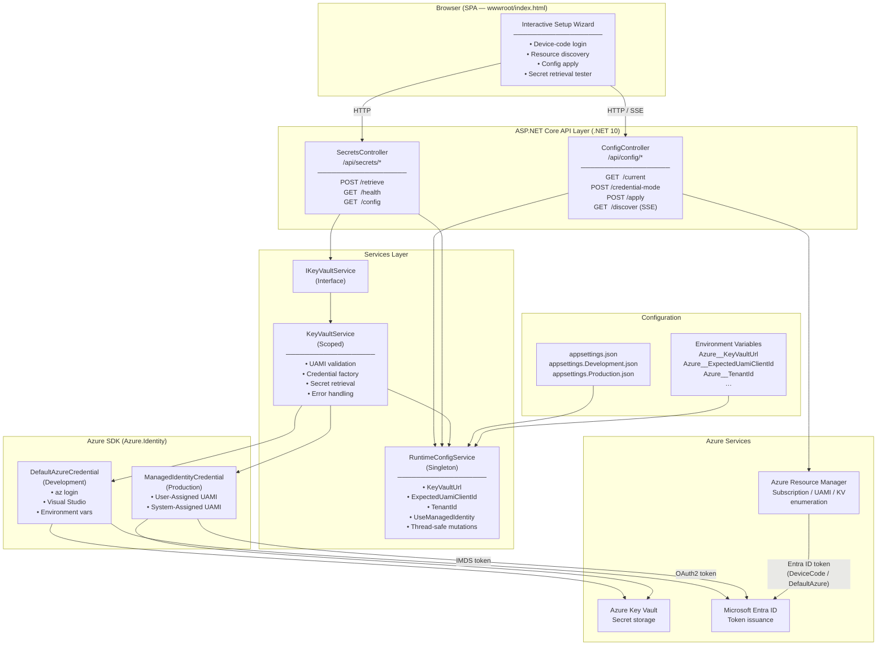
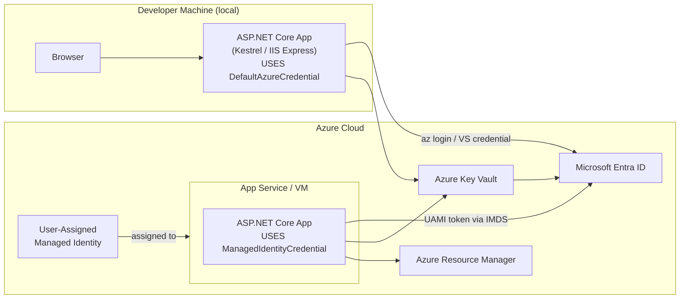
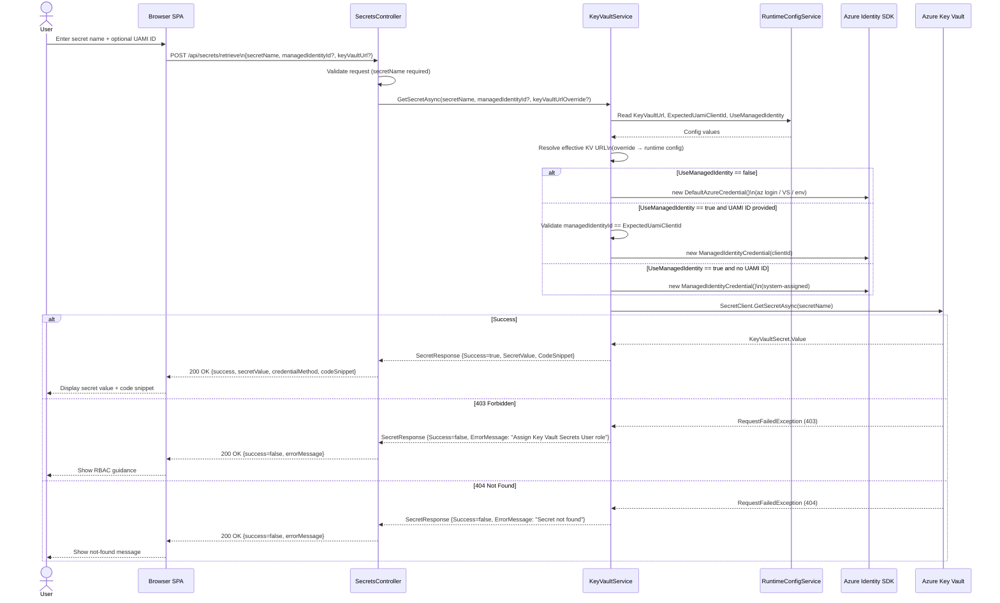
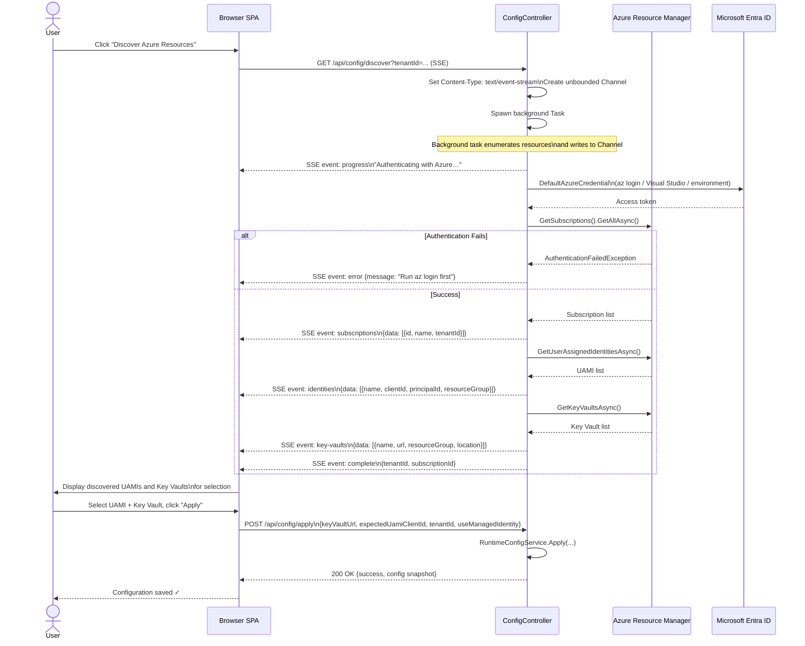
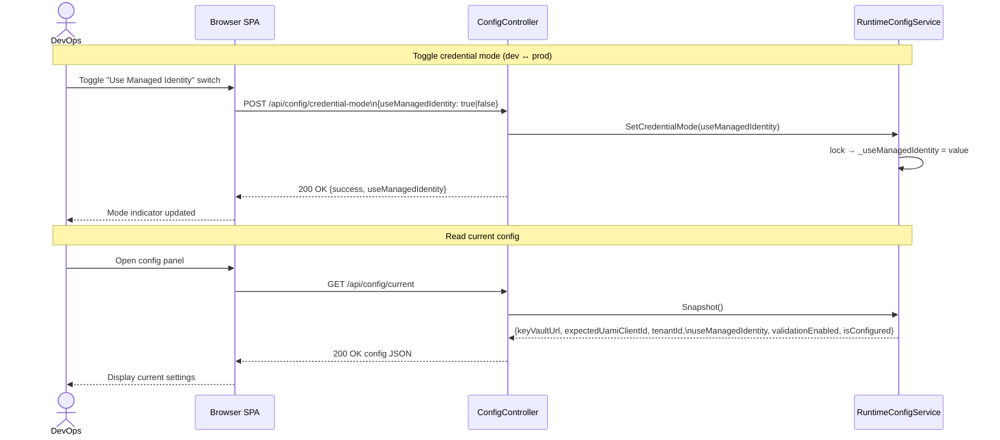

# UAMIDemo.Web – Architecture & Sequence Diagrams

This document provides architecture and sequence diagrams to help developers understand the system structure and key workflows of **UAMIDemo.Web** — a .NET 10 ASP.NET Core application that demonstrates secure Azure integration using **User-Assigned Managed Identity (UAMI)**.

---

## Table of Contents

1. [Architecture Diagram](#1-architecture-diagram)
2. [Component Descriptions](#2-component-descriptions)
3. [Sequence Diagrams](#3-sequence-diagrams)
   - [Secret Retrieval Flow](#31-secret-retrieval-flow)
   - [Azure Resource Discovery Flow](#32-azure-resource-discovery-flow-sse)
   - [Runtime Configuration Update Flow](#33-runtime-configuration-update-flow)
4. [Architectural Patterns](#4-architectural-patterns)
5. [Security Design](#5-security-design)

---

## 1. Architecture Diagram

### Deployment View

---

## 2. Component Descriptions

### Browser SPA (`wwwroot/index.html`)
A single-page application (37 KB) that guides users through Azure configuration without storing any credentials:
- **Setup Wizard**: Initiates device-code authentication, streams SSE events, and lets users select discovered UAMIs and Key Vaults.
- **Credential Toggle**: Switches between `ManagedIdentityCredential` (production) and `DefaultAzureCredential` (development) at runtime.
- **Secret Tester**: Retrieves secrets and shows the equivalent C# code snippet for educational purposes.

### ConfigController (`/api/config`)
Manages runtime configuration state and triggers Azure resource discovery:

| Endpoint | Method | Responsibility |
|---|---|---|
| `/api/config/current` | GET | Returns a snapshot of the live in-memory config |
| `/api/config/credential-mode` | POST | Toggles `ManagedIdentity` ↔ `DefaultAzureCredential` |
| `/api/config/apply` | POST | Persists discovered Key Vault URL, UAMI ID, Tenant ID |
| `/api/config/discover` | GET (SSE) | Streams resource discovery events to the browser |

### SecretsController (`/api/secrets`)
Handles Key Vault secret retrieval:

| Endpoint | Method | Responsibility |
|---|---|---|
| `/api/secrets/retrieve` | POST | Retrieves a named secret from Key Vault |
| `/api/secrets/health` | GET | Health check (status, timestamp, environment) |
| `/api/secrets/config` | GET | Returns the current runtime config snapshot |

### RuntimeConfigService (Singleton)
The central in-memory configuration store. Values are seeded from `appsettings.json` and environment variables at startup and may be updated live by the Setup wizard without restarting the application. All property access is protected by a `lock` for thread safety.

| Property | Purpose |
|---|---|
| `KeyVaultUrl` | Target Key Vault endpoint |
| `ExpectedUamiClientId` | Validates that requests use the authorized UAMI only |
| `TenantId` | Microsoft Entra ID tenant |
| `UseManagedIdentity` | `true` = UAMI (production), `false` = DefaultAzure (development) |

### IKeyVaultService / KeyVaultService (Scoped)
Abstracts all Azure Key Vault interactions. The interface enables unit testing with mock implementations. The concrete `KeyVaultService`:
1. Resolves the effective Key Vault URL (request override → runtime config → error).
2. Validates that the supplied UAMI matches the configured `ExpectedUamiClientId`.
3. Creates the appropriate `TokenCredential` via a factory method.
4. Calls `SecretClient.GetSecretAsync` and maps Azure exceptions to user-friendly `SecretResponse` objects.
5. Generates C# code snippets for educational display.

### Azure SDKs
- **`Azure.Identity`**: Provides `DefaultAzureCredential` (development chain) and `ManagedIdentityCredential` (production UAMI/system-assigned).
- **`Azure.Security.KeyVault.Secrets`**: `SecretClient` for reading secrets from Key Vault.
- **`Azure.ResourceManager`**: `ArmClient` for enumerating subscriptions, UAMIs, and Key Vaults during the discovery wizard.

---

## 3. Sequence Diagrams

### 3.1 Secret Retrieval Flow

---

### 3.2 Azure Resource Discovery Flow (SSE)

---

### 3.3 Runtime Configuration Update Flow

---

## 4. Architectural Patterns

| Pattern | Where Used | Benefit |
|---|---|---|
| **Dependency Injection** | Controllers inject `IKeyVaultService`, `RuntimeConfigService`; services inject `IOptions<AzureSettings>` | Loose coupling, testability via interface substitution |
| **Interface Abstraction (Repository-like)** | `IKeyVaultService` decouples controllers from Azure SDK | Enables unit testing with mock implementations |
| **Singleton for Shared Mutable State** | `RuntimeConfigService` registered as `AddSingleton` | Live config changes propagate immediately to all request handlers without app restart |
| **Strategy Pattern** | `KeyVaultService.CreateSecretClient()` selects `DefaultAzureCredential` or `ManagedIdentityCredential` based on mode | Supports both local development and production UAMI auth without code changes |
| **Factory Method** | `CreateSecretClient()` creates `SecretClient` with the correct credential | Encapsulates credential construction; client is always created fresh per request to pick up latest config |
| **Observer / Push via SSE** | `ConfigController.Discover()` uses `System.Threading.Channels` + SSE | Decouples long-running discovery work from the HTTP response stream; provides real-time progress without polling |
| **Options Pattern** | `IOptions<AzureSettings>` bound to `appsettings.json` `"Azure"` section | Structured configuration, validated at startup |
| **Placeholder Guard** | `RuntimeConfigService.IsReal()` ignores values starting with `<` | Prevents accidental use of template placeholder strings as real Azure configuration |

---

## 5. Security Design

| Concern | Design Decision |
|---|---|
| **No secrets in source** | `appsettings.json` holds only `<placeholder>` values. Real values come from OS environment variables or the in-memory discovery wizard. |
| **UAMI identity validation** | `KeyVaultService` compares the supplied `managedIdentityId` against `ExpectedUamiClientId`. Mismatches are rejected before any Azure call is made. |
| **Credential isolation** | Development uses `DefaultAzureCredential` (IMDS excluded to prevent hangs). Production uses `ManagedIdentityCredential` only. |
| **RBAC guidance** | A `403` from Key Vault produces a human-readable message prompting the user to assign the `Key Vault Secrets User` role. |
| **Thread-safe state** | All `RuntimeConfigService` reads/writes are protected by a `lock` object, preventing race conditions during concurrent requests. |
| **No browser credential storage** | The discovery wizard stores selected values in the server's in-memory `RuntimeConfigService` only; nothing is persisted to disk or cookies. |
